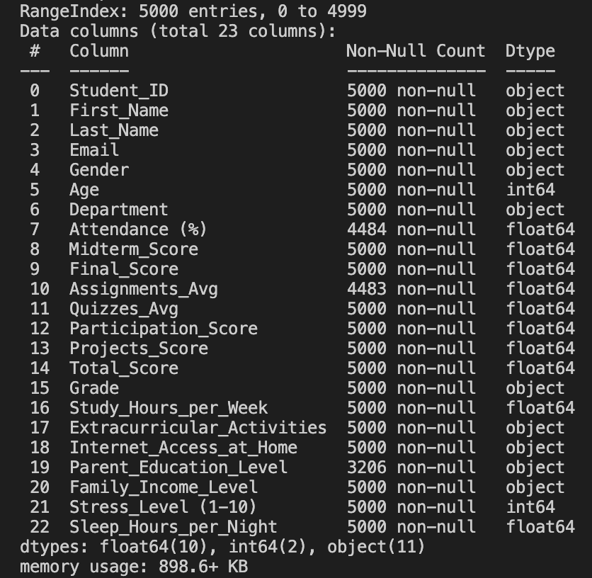
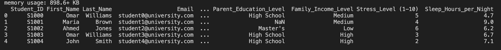
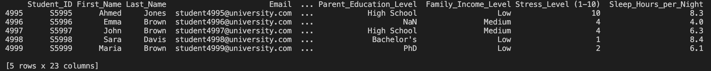
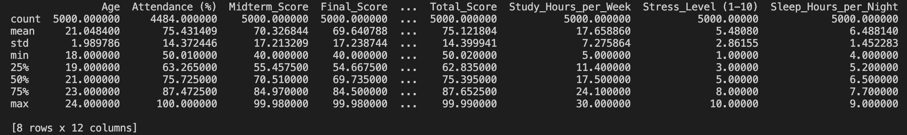

### Students' grades database analysis
``` df.info() ``` 
Outputs columns and number of values there 



``` print(df.head()) ```
Outputs first 5 rows



``` print(df.tail()) ```
Outputs last 5 rows



``` print(df.describe()) ```
Outputs basic statistics such as mean, std, etc.


